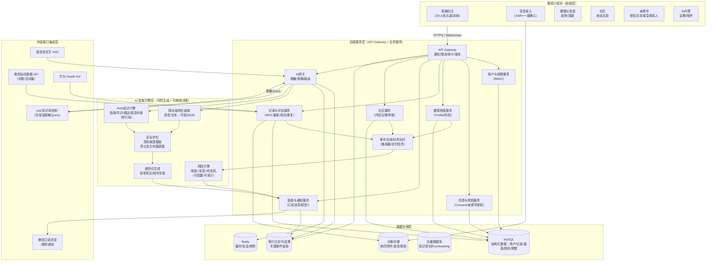

下面是“核心技术（≤4页）”最终定稿的 PPT 设计稿（可直接照此制作）。已把你给的架构草图、零负担采集/降低失访、AI 深度融合（含 ima 检索脱敏流程）、规则预警/个性化推送等内容整合成统一叙事，并提供**可直接生成 SVG 的专业技术架构图（Mermaid 代码）**。

---

## 全局版式与视觉规范（建议固定到母版）
- **主色**：#2B5FA6（医疗专业蓝）  
- **辅色**：#4ECDC4（科技青绿）  
- **强调色**：#FF6B6B（预警红）  
- **背景**：#F8FAFF  
- **字体**：思源黑体（标题/小标题），思源宋体或思源黑体（正文）  
- **线条**：1.25pt；模块圆角 8px；模块间留白 ≥ 24px  
- **页脚**：右下角灰字 10pt 放参考/注释；左下角页码 1/4…  

---

# 第1页（1/4）技术架构总览：微信小程序 × 事件驱动 × AI 中台
## 页面目标
一页讲清：系统如何“采集—建档—评估—干预—随访闭环”，以及 AI 在哪一层“深度融合”。

## 版式（推荐 65/35）
- **左侧 65%：专业技术架构图（主视觉）**
- **右侧 35%：3 条核心技术亮点 + 1 条可落地说明**

## 左侧：技术架构图（可直接用 Mermaid 生成 SVG）
> 制作方式：把下方 Mermaid 代码粘到支持 Mermaid 的编辑器（如 mermaid.live）导出 SVG，再放入 PPT。  
> PPT 内部也可用形状复刻（建议先用 SVG 版本保证专业度）。

\* 号说明：可作为“扩展接口位”，Demo 阶段可只做微信运动 + 订阅消息 + ASR。

## 右侧：可直接粘贴文案
**核心技术亮点**
1. **事件驱动闭环**：每次记录触发评估与预警；定时任务生成周报/推送；失访触发召回与亲情号联动。  
2. **安全可解释的决策智能**：规则/量表/状态机优先（可配置、可审计、可复盘），AI 负责通俗化表达与个体化教育。  
3. **AI 深度融合而非“聊天框”**：语音→结构化随访、RAG 证据检索、报告自动生成、陪伴式推送。

**落地形态**
- 微信小程序 + 云托管/Serverless：低运维、易 Demo、便于快速迭代与试点部署。

---

# 第2页（2/4）创新一：零负担数据采集（破解30–60%失访）
## 页面目标
把“随访”从“问卷上班”变成“10 秒打卡 + AI 自动补全”，直接对应你们商业可行性（低人工成本）。

## 版式（推荐 50/50 + 底部对比条）
- **左 50%：2D 人体标注交互示意（大图）**
- **右 50%：AI 快速采集流程（纵向流程图）**
- **底部通栏：传统随访 vs 舒伴随访（对比表）**

## 左侧配图（UI 示意图要求）
- 一张**前视/后视 2D 人体轮廓**（建议 SVG）
- 支持两种交互的图标说明：  
  - 点选区域（region）  
  - 涂抹热区（paint heatmap，颜色深浅=强度）
- 右侧浮层卡片（适老大按钮）：
  - 部位：腰背（自动填）  
  - 强度：0–10 大滑条  
  - 完成：一键保存（≤10 秒）

> 备注小字（灰 10pt）：Canvas 触摸事件 + 预定义区域映射；数据保存为结构化 region_id 列表（不保存人体图片，隐私更友好）。

## 右侧配图：AI 快速采集（流程图文案可直接贴）
**一句话随访 → 结构化 → 一键确认（减少阅读/输入）**
1) 用户语音：*“今天腰疼 7 分，走路会加重，吃了止痛药。”*  
2) ASR 转写 → **字段抽取（JSON）**：部位/强度/诱因/用药  
3) 弹出“确认卡片”：**确认 / 修改（点按）**  
4) 写入健康时间线（Timeline Event）→ 触发风险评估与个体化宣教

右侧再放一个小框（3行 bullets）：
- 步数骤降 → 自动提示“活动受限”采集  
- 服药后 X 小时 → 自动追踪“疗效/不良反应”  
- 连续未记录 → 失访召回 + 亲情号兜底

## 底部对比表（建议 3 列 4 行，字少）
| 关键数据 | 传统问卷/人工随访 | 舒伴 SoothPal（零负担采集） |
|---|---|---|
| 疼痛部位/强度 | 每日问卷/文字输入 | 2D 点选/涂抹 + 10秒打卡 |
| 功能影响 | 多题量表，易疲劳 | 步数/行为触发 + 1次点击 |
| 用药疗效 | 复诊回忆偏差大 | 服药后自动追踪 + AI卡片确认 |
| 失访管理 | 人工催访成本高 | 状态机召回 + 亲情号联动 |

页脚灰字（引用/事实表达建议用“调研+文献”口径）：  
- 慢性疼痛长周期研究常见较高失访（约 30–60%，团队调研与既往研究共识）；本方案以“极简交互 + AI 自动结构化”降低日常负担，从机制上提升随访完成率。

---

# 第3页（3/4）创新二：危机预警与个性化推送（可解释、可配置、可审计）
## 页面目标
突出“医疗场景最需要的可靠性”：**规则底线** + **状态机个体化** + **分级响应**，并和推送系统联动。

## 版式（左图右表）
- **左 55%：双路径预警逻辑图（静态阈值 + 动态状态机）**
- **右 45%：分级响应表 + 推送混合策略**

## 左侧配图（画成两条并行管道，最后汇合）
**Path A：静态阈值/突变（急性风险）**
- NRS ≥ 8  
- 当日较 7 日均值突增 ≥ 3 且当日 ≥ 6

**Path B：治疗周期状态机（慢性风险）**
- 术后第 1 周 / 康复期 / 药物敏感期  
- 阈值动态调整 + 连续性判定（持续高痛、依从性下降）

两条路径汇合到：**Risk Level 1/2/3 → Action Dispatcher（通知/报告/宣教）**  
左下角标一行小字：触发器/云函数实时执行，输出携带 `rule_id + reason`，可审计复盘。

## 右侧：分级响应表（可直接粘贴）
**分级响应（示例，可配置）**
- **Level 1 高危**：NRS≥8 或 突增>3  
  - 动作：强提醒弹窗 +（授权）亲情号通知 + 就医建议模板 + 紧急摘要报告  
- **Level 2 中危**：5–7 分持续≥3天 / 特殊阶段异常  
  - 动作：建议联系医生 + 推送针对性并发症/康复注意事项  
- **Level 3 依从性/失访**：超过 X 天未记录且未“暂停”  
  - 动作：温和召回 + 24h 延迟队列（限流去打扰）+ 亲情号兜底提醒

**个性化推送（混合策略）**
- 日常：标签画像匹配（部位/病因/阶段/偏好）  
- 危机：风险消息置顶覆盖常规科普（安全优先）  
- 全程：去重 + 限频（防打扰，提高留存）

页脚参考（灰字 10pt，选2条即可）：  
- 疼痛自动识别与多模态融合研究综述（支瑞聪等，2020；朱南希等，2022）为风险识别与融合策略提供理论依据。  

---

# 第4页（4/4）创新三：AI 深度融合（RAG + 脱敏检索 + 安全护栏）与可行性
## 页面目标
把你提出的“ima 接入：匿名化检索→通俗化输出→隐私保护”讲成**可行的工程方案**，并体现你们的专业壁垒（可追溯知识库 + 安全护栏）。

## 版式（上流程图 + 下要点卡片）
- **上 60%：RAG/Agent 时序图（突出脱敏与引用）**
- **下 40%：3 张卡片：知识库资产化 / 安全合规 / 成熟度与扩展**

## 上半部分配图：RAG + ima 接入（建议画成时序/泳道图）
**泳道 1：小程序 Agent**  
- 接收用户提问（可能含隐私）

**泳道 2：AI 网关（你们后端）**  
- 脱敏/去标识化（正则 + 词典 + 语义泛化）  
- 生成“最小必要 Query”（仅保留医学要点）  
- 策略路由：本地知识库优先；需要时再调用 ima 检索

**泳道 3：ima 知识库检索（外部）**  
- 仅接收脱敏 Query  
- 返回证据片段（chunk_id / 来源）

**回到 AI 网关**  
- 将证据片段 + 用户画像（画像不外发）→ 通俗化生成  
- **强制安全护栏**：高危就医模板 / 禁止具体处方剂量 / 输出带引用

**返回小程序**  
- 输出：步骤化、适老短句 + “参考来源”按钮

> 图上用红色小盾牌标注 2 个“隐私不出域”：用户画像、原始病历附件不发送外部。

## 下半部分：三张卡片（每张 3 行以内，字少）
**卡片1｜知识库资产化（专业壁垒）**  
- 指南/共识/循证/医生科普 → 结构化切片  
- 向量检索 + 版本管理 + 专家审核  
- 输出带引用（可追溯、可质控）

**卡片2｜安全合规护栏（医疗场景可控）**  
- 先规则后生成：风险引擎定“该不该做”  
- AI 只做“怎么说/怎么教”（通俗化）  
- 同意台账 + 权限控制 + 审计留痕

**卡片3｜成熟度与扩展（Demo→试点）**  
- Demo：语音结构化、RAG 引用回答、分级预警、亲情号通知  
- 扩展：对接更多健康数据平台/可穿戴  
- 研究增强：多模态疼痛识别（面部/生理信号）可作为后续模块化接入

页脚参考（灰字，选你们已有文献中最强的2–3条）：  
- 人脸疼痛表情识别综述（彭进亚等，2016）；多模态疼痛评估进展（朱南希等，2022）；EEG 疼痛识别研究（李冬，2019）。  

---

## 交付检查清单（确保“核心技术≤4页”）
1) **第1页架构图必须清晰**：模块命名与数据流方向明确；突出“事件驱动”和“AI网关脱敏”。  
2) **第2页必须回答“怎么采到数据 + 为什么不失访”**：10秒打卡、语音结构化、一键确认、触发式补问。  
3) **第3页必须体现医疗安全**：规则/状态机/分级响应、可配置可审计。  
4) **第4页必须讲清 AI 深度融合与隐私方案**：ima 脱敏检索可行、输出带引用、有安全护栏。  
